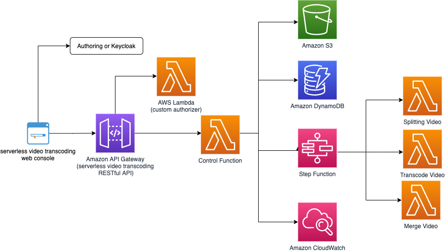

# Serverless Video Transcode Solution
The Serverless Video Transcode project is created to let aws customer use lambda function to transcode video files. The serverless architecture use Step Function in backend to trigger several lambda function to transcode video file concurrently. This solution is suitable for fast video transcoding on demand.

## File Structure
The Serverless Video Transcode project consists of microservices that facilitate the functional areas of the solution. These microservices are deployed to a serverless environment in AWS Lambda.

<pre>
|-deployment/ [folder containing templates and build scripts]
|-source/
  |-api/
    |-authorizer/ [custom authorizer for api gateway]
    |-services/
      |-admin/ [microservice for Serverless Video Transcode administrative functionality]
      |-cart/ [microservice for Serverless Video Transcode cart functionality]
      |-logging/ [microservice for Serverless Video Transcode audit logging]
      |-manifest/ [microservice for Serverless Video Transcode manifest processing]
      |-package/ [microservice for Serverless Video Transcode task functionality]
      |-profile/ [microservice for Serverless Video Transcode user profile functionality]
      |-search/ [microservice for Serverless Video Transcode search functionality]
    |-transcode
      |-controller_function [microservice to seperate the video file and save to EFS]
      |-merge_video_function [microservice to merge transcoded video files on EFS into one video]
      |-transcode_video_function [microservice to transcode the video file and save the output to EFS]
      |-trigger_statemachine_function [microservice to trigger the Step function]
  |-console/ [Serverless Video Transcode angularjs management console]
  |-resource/
    |-access-validator/ [auxiliar module used to validate granular permissions]
    |-helper/ [custom helper for CloudFormation deployment template]
</pre>
Each microservice except transcode follows the structure of:

<pre>
|-service-name/
  |-lib/
    |-[service module libraries and unit tests]
  |-index.js [injection point for microservice]
  |-package.json
</pre>

## Getting Started
#### 01. Prerequisites

The Serverless Video Transcode solution is developed with Node.js for the microservices that run in AWS Lambda and Angular 1.x for the console user interface. The latest version of the Serverless Video Transcode solution has been tested with Node.js v12.x. The transcoded related lambda is developed with Python 3.7.

## Architecure

***

Copyright 2021 Amazon.com, Inc. or its affiliates. All Rights Reserved.

Licensed under the Apache License, Version 2.0 (the "License"); you may not use this file except in compliance with the License. You may obtain a copy of the License at

http://www.apache.org/licenses/LICENSE-2.0 

Unless required by applicable law or agreed to in writing, software distributed under the License is distributed on an "AS IS" BASIS, WITHOUT WARRANTIES OR CONDITIONS OF ANY KIND, either express or implied. See the License for the specific language governing permissions and limitations under the License.
