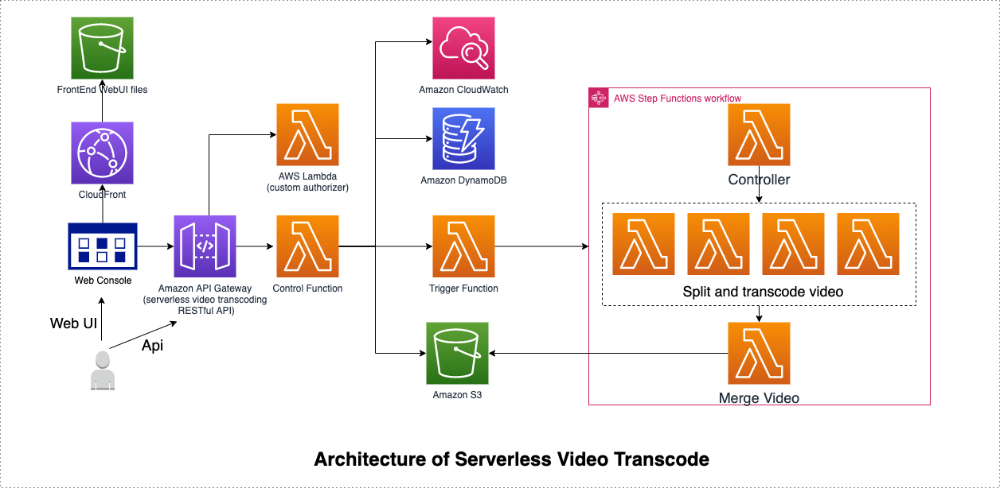
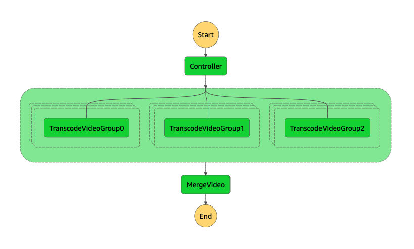
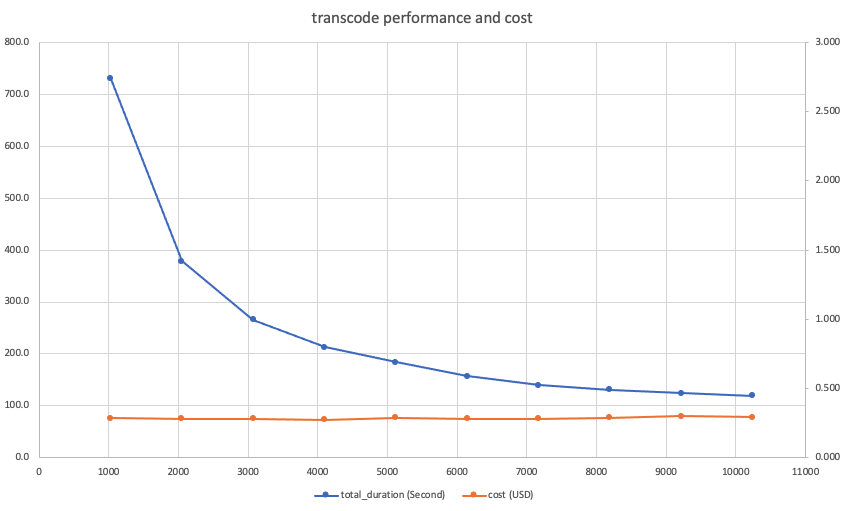

# 基于Lambda的无服务器视频转码方案

在 re:Invent 2020 上，AWS Lambda推出了大函数支持。AWS Lambda客户可以设置Lambda函数的最大内存为 10,240 MB(10GB)，与之前最大内存3,008MB的限制相比增加了3倍多。Lambda函数配置更大的内存有助于更快的执行大规模内存密集型操作，比如批处理、提取、转换、加载(ETL)作业和处理媒体音视频文件等。

由于Lambda函数根据配置的内存大小按比例分配CPU能力，因此客户现在可以访问多达6个vCPU。这有助于更快地执行机器学习、建模、基因组学和高性能计算(HPC)应用程序等计算密集型应用程序。在这篇博文中，我们将介绍基于无服务器架构的视频转码方案的设计，并展示其在大内存Lambda函数中的性能。

### 简介

视频转码是一项计算密集型任务。 在 c5.large实例上，将1小时长的1080p h264视频转码为720p h264视频可能需要计算将近2小时。Lambda函数的最大超时时间为15分钟，貌似单个Lambda函数似乎不太适合作为视频转码的计算平台。
但是，因为客户特别喜欢Lambda函数的快速扩展、按使用量付费且无需自己管理服务器的特性，多个客户自己找到了使用 Lambda函数来运行并行视频转码系统的创新方法。2017年，Revvel为Verizon构建了无服务器视频转码系统，可以在不到10分钟的时间内完成一个两小时的视频转码任务[1]。 同样在2017年，斯坦福大学的Sadjad Fouladi设计了一个名为ExCamera的系统，可以对视频进行低延迟编辑、转换和编码。ExCamera通过并行运行5000个Lambda可以在2分36秒内将时长为14分48秒的4k原始视频@20dB编码到VP8编解码器[2]。2020年6月，来自A Cloud Guru的Peter Sbarski使用Lambda函数、Step Functions工作流和EFS文件系统构建了一个无服务器视频转码演示。Peter演示了该系统可以在3分钟内完成1GB MKV的视频转码 [3]。

这些成功案例证明基于Lambda函数的无服务器视频转码不仅可行，而且很实用。本篇博客让我们来给大家介绍一个简单的无服务器视频转码方案。

### 基于无服务器视频转码解决方案

无服务器视频转码是一种典型的并行视频转码系统: 将输入视频分成小到可以在15分钟内处理完的视频片段，并行处理每个视频片段，并将处理后的视频片段合并成一个完整的输出视频。它由4个lambda函数、1个Step Functions 工作流和用于输入和输出视频的 S3 存储桶组成。Lambda是无服务器计算平台，Amazon Step Functions工作流负责协调多个视频转码Lambda函数的执行。Amazon S3用于长期存储视频文件。整个解决方案无需用户管理任何EC2实例。


解决方案是这样工作的: 用户通过命令行或者Web控制台将一个视频上传到输入S3桶，S3调用TriggerWorkflow lambda函数。TriggerWorkflow lambda函数启动Step Function工作流以对输入视频文件进行转码。工作流包括3个步骤：

1. 控制器函数分析输入的需要转码的原始视频文件，通过分析原始视频文件生成下一步操作所需要的控制数据，例如输入视频将被分成多少个视频片段，每个视频片段的时长，每个视频片段的开始位置。
2. Step Functions工作流启动并发Transcoder lambda函数并传入每个视频片段的开始时间和持续时间。每个转码器将从S3读取其分配的输入视频片段并将其转码并将结果保存到S3桶。
3. 当所有Transcoder lambda函数完成后，Step Functions 启动MergeVideo Lambda函数。MergeVideo Lambda函数将从S3中读取所有转码后的视频片段，将它们合并为一个完整的视频，最终上传到S3输出桶。

**FFmpeg Layer**

lambda 函数使用开源[FFmpeg](https://ffmpeg.org/)来检查和处理视频文件。您可以从无服务器应用程序存储库部署[ffmpeg-lambda-layer](https://serverlessrepo.aws.amazon.com/applications/arn:aws:serverlessrepo:us-east-1:145266761615:applications~ffmpeg-lambda-layer)或构建您自己的层包装 [FFmpeg 静态构建](https://johnvansickle.com/ffmpeg/)[。](https://johnvansickle.com/ffmpeg/%EF%BC%89%E3%80%82)

**控制函数**

在控制函数功能中，我们运行以下[ffprobe](https://ffmpeg.org/ffprobe.html)命令来检查输入视频文件。“video_file_url”是 S3 上输入视频的[预签名 url](https://docs.aws.amazon.com/AmazonS3/latest/userguide/using-presigned-url.html)。

```
ffprobe -v error -show_format -show_streams -of json video_file_url
```

这允许我们在不下载整个文件的情况下获取原始视频文件的元数据。 控制函数可以使用元数据来决定视频片段的数量和每个视频片段的持续时间。控制器函数将每个视频片段的开始时间戳(start_ts)和持续时间传递给转码函数。

**转码函数**

在转码函数中，我们使用以下ffmpeg命令将从start_ts时间戳剪切到start_ts+duration，并将分辨率缩小到 720p。 我们还添加了“-x264opts stitchable”来允许最终视频的合并，这样我们就可以毫无问题地将多个转码完成的视频片段合并成一个完整的视频。 如果音频流是aac编码的，我们只需将其复制到输出。

```
ffmpeg -v error -ss start_ts-1 -i video_file_url -ss 1 -t duration
       -vf scale=-1:720 -x264opts stitchable -c:a copy -y output_filename
```


“video_file_url”是输入视频的[S3预签名网址](https://docs.aws.amazon.com/AmazonS3/latest/userguide/using-presigned-url.html)。这允许转码器Lambda函数并行处理视频的一小部分，而无需先下载整个视频文件。分段转码的输出视频文件会存储在S3桶中以供下一步使用。

**合并视频函数**

在 合并视频函数中，它将读取转码后的视频片段文件名列表并写入到 segmentlist.txt文件中，然后运行以下ffmpeg命令将所有部分合并成一个完整的视频文件。

```
ffmpeg -v error -f concat -safe 0 -i segmentlist.txt -c copy video_filename
```

当完成了视频文件的合并操作后，该函数会将完整的输出视频文件上传到S3原始视频所在位置的output目录

**Step Functions 视频转码工作流**

我们使用Step Functions 来协调视频转码工作流程。为了加快转码，并行处理是关键。Step Functions Dynamic Parallelism 允许我们通过传入一个数组作为输入来启动并行lambda函数。但是MAP状态当前限制最多只能有40个并发的tasks。 为了实现更高的并发性，我们使用并行状态添加了3个MAP分支。 这允许最多120个并发。 如果需要更高的并发性，我们可以在MAP状态中嵌套另一个MAP状态，它可以达到 1600 个并发。

### **Performance with larger Lambda Functions**

### 更大 Lambda 函数的性能

我们使用此[测试视频](https://sls-northeast-1.s3-ap-northeast-1.amazonaws.com/input/wildlife01/wildlife_1h_4k.mp4)测试了此无服务器视频转码器方案。 该视频是1小时长的4K(3840x2160)mp4视频。 视频流采用h264编解码器编码，音频流采用aac编解码器编码。帧速率为25fps。 文件大小为6.8GB。

在测试中，我们将视频分成30个片段，每个视频片段时长约2分钟，并将视频转码为720p(1080x720)的mp4文件。 同时启动30个并发视频转码Lambda函数并行运行来进行视频转码。除Transcoder功能外，所有lambda功能均配置有10GB内存。 我们将Transcoder功能的内存从1GB增加到10GB，增量为1GB。下图显示了转码工作流程的总持续时间和相应的 Lambda成本。


我们可以看到当Transcoder函数内存增加时，转码时间减少。在10GB内存下，转码在 119秒内完成。Lambda成本为 0.293 美元。输出视频每分钟0.0049美元。 当lambda内存从1GB增加到10GB时，性能会提高，而Lambda成本保持不变。


### 视频转码API

部署完成后，方案提供一个api gateway restful接口/transcode 提供用户进行调用，用户首先需要将需要转码的原始视频上传到方案部署的region所在的S3中，同时需要提供转码方案所在账号读写S3对应的bucket的权限，因为视频转码Lambda函数需要读取原始视频并在原始视频所在目录创建output目录，并将转码后的视频文件放在output目录中。
部署完成后，用户可以通过transcode的api进行转码，采用Post调用，下面是post消息结构体样例

```
{ "bucket": "ffmpeg-layer-eu", //原始视频所在S3 Bucket
  "key": "waterdrop.mp4",      //原始视频对应的S3 key
  "options": {                 //视频转码对应的参数
    "resolution": "360",       //目标视频分辨率
    "bitrate": "ORIGINAL",     //目标视频码率
    "codec": "ORIGINAL",       //目标视频codec
    "manualOptions": "",       //ffmpeg特定的参数，
    "segment_time": 30 ,       //视频分片的时间长短，默认是60秒，可以通过这个参数修改
    "aws_region" : "eu-central-1" //视频源文件所在的S3 Bucket对应的region，如果不指定的话转吗方案会使用转吗方案部署的region去读取S3文件
    }
}
```

api会启动视频转码的Step-Function，返回视频转码Step-Function对应的Arn，比如下面的例子：

```
{
 "statusCode": 200,
 "body": "\"arn:aws-cn:states:cn-north-1:065717342743:execution:MainStateMachine-ShPWBXk9mwX5:3f1fc607-b585-41ba-b3b3-fe68f1ac58fd\""
}
```

用户可以通过aws cli stepfunction describe-execution来获取这个转码任务的状态，比如下面的样例输出：

```
describe-execution —execution-arn arn:aws-cn:states:cn-north-1:xxxxxx:execution:MainStateMachine-ShPWBXk9mwX5:3f1fc607-b585-41ba-b3b3-fe68f1ac58fd
{
"executionArn": "arn:aws-cn:states:cn-north-1:065717342743:execution:MainStateMachine-ShPWBXk9mwX5:3f1fc607-b585-41ba-b3b3-fe68f1ac58fd",
"stateMachineArn": "arn:aws-cn:states:cn-north-1:065717342743:stateMachine:MainStateMachine-ShPWBXk9mwX5",
"name": "3f1fc607-b585-41ba-b3b3-fe68f1ac58fd",
"status": "SUCCEEDED",
"startDate": 1636356418.774,
"stopDate": 1636356426.48,
"input": "{\"job_id\": \"146d8d6b-b0bb-4dd6-8111-06b72f9b77b6\", \"bucket\": \"test-api-minggu-20211029\", \"key\": \"video/waterdrop.mp4\", \"object_prefix\": \"video/\", \"object_name\": \"waterdrop.mp4\", \"segment_time\": 30, \"create_hls\": \"0\", \"options\": {\"resolution\": \"360\", \"bitrate\": \"ORIGINAL\", \"codec\": \"ORIGINAL\", \"manualOptions\": \"\", \"segment_time\": 30, \"aws_region\": \"cn-north-1\"}}",
"inputDetails": {
"included": true
},
"output": "{\"input_segments\": 1, \"merged_video\": \"s3://test-api-minggu-20211029/video/output/waterdrop.mp4\", \"create_hls\": 0, \"output_bucket\": \"test-api-minggu-20211029\", \"output_key\": \"video/waterdrop.mp4\"}",
"outputDetails": {
"included": true
},
"traceHeader": "Root=1-6188d142-e9953a2b8b88c142e69d84d7;Sampled=1"
}
```

### 方案部署

如果想尝试使用这个方案进行转码操作，可以使用下面的步骤进行cloudformation一键式部署：

1. 登陆到亚马逊云科技的账户控制面板。

1. 点击下面的链接跳转到cloudformation的控制台进行部署

使用Quickstart/templates目录下的CloudFormation模版，可以快速完成部署。这个模版会新建带有两个公有子网的VPC, S3和DynamoDB Endpoints, S3存储桶，DyanomDB表，EFS文件系统, Lambda函数和Step Functions状态机。

|           Region            |                     Launch Stack in VPC                      |
| :-------------------------: | :----------------------------------------------------------: |
| **中国区**  | [](https://console.amazonaws.cn/cloudformation/home#/stacks/create/template?stackName=serverless-video-transcode&templateURL=https://aws-gcr-solutions.s3.cn-north-1.amazonaws.com.cn/serverless-video-transcode/v1.063/serverless-video-transcode-deploy.template) |
| **海外区**  | [](https://console.aws.amazon.com/cloudformation/home#/stacks/create/template?stackName=serverless-video-transcode&templateURL=https://aws-gcr-solutions.s3.amazonaws.com/serverless-video-transcode/v1.063/serverless-video-transcode-deploy.global.template) |

### 结论

借助AWS Lambda大型函数支持，客户可以立即访问每个AWS区域的6000个vCPU。这种巨大的计算能力可以在Lambda上实现更多的计算密集型和内存密集型工作负载。

我们还展示了我们可以使用AWS Lambda、AWS Step Functions构建并行视频转码器。 它可以快速且廉价地转码视频。 无服务器视频转码器代码可在此处的[GitHub](https://github.com/bnusunny/serverless-video-transcoder)上找到。


**References:**
**参考资料**

[1] November 27, 2017, Greg Femec, Revvel, Building a Serverless Pipeline to Transcode a Two-Hour Video in Minutes (SRV314, AWS re:Invent 2017)
https://www.youtube.com/watch?v=lleCVR2Mupw

[2] 2017, Encoding, Sadjad Fouladi, Stanford University, Fast and Slow: Low-Latency Video Processing Using Thousands of Tiny Threads (USDI 2017)
https://www.usenix.org/conference/nsdi17/technical-sessions/presentation/fouladi

[3](https://medium.com/@sbarski?source=post_page-----96575bc85157--------------------------------), A Cloud Guru, How I used Lambda and EFS for massively parallel processing
https://acloudguru.com/blog/engineering/how-i-used-lambda-and-efs-for-massively-parallel-compute
